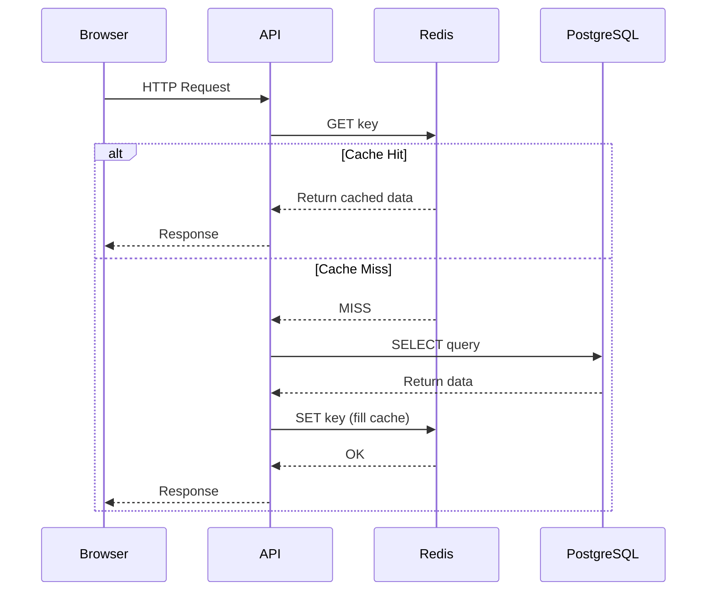

```mermaid
sequenceDiagram
    participant Browser
    participant API
    participant Redis
    participant PostgreSQL

    Browser->>API: HTTP Request
    API->>Redis: GET key
    alt Cache Hit
        Redis-->>API: Return cached data
        API-->>Browser: Response
    else Cache Miss
        Redis-->>API: MISS
        API->>PostgreSQL: SELECT query
        PostgreSQL-->>API: Return data
        API->>Redis: SET key (fill cache)
        Redis-->>API: OK
        API-->>Browser: Response
    end
```